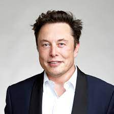
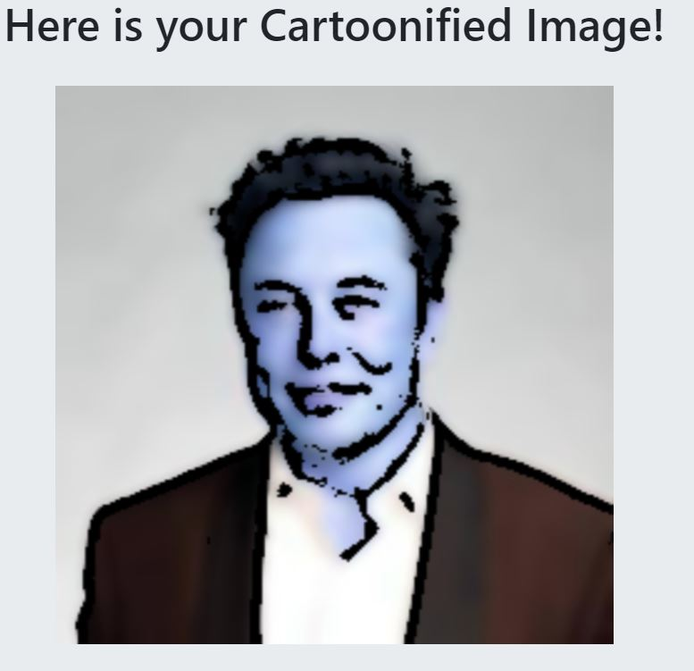
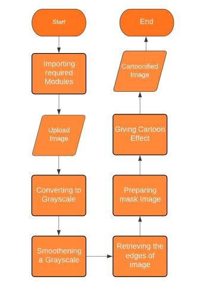

# Cartoonify an Image with OpenCV in Python.
Here our objective is to transform images into cartoon using openCV

### Following are the steps I followed to convert image into cartoon
1. Importing the required modules.
2. Getting the image from the user for cartoonification
3. Transforming an image to grayscale
4. Smoothening a grayscale image
5. Retrieving the edges of an image
6. Preparing a Mask Image
7. Giving a Cartoon Effect
8. Saving the image

### Input Image                                                                       
 
### Output Image
 

### Flowchart
 
